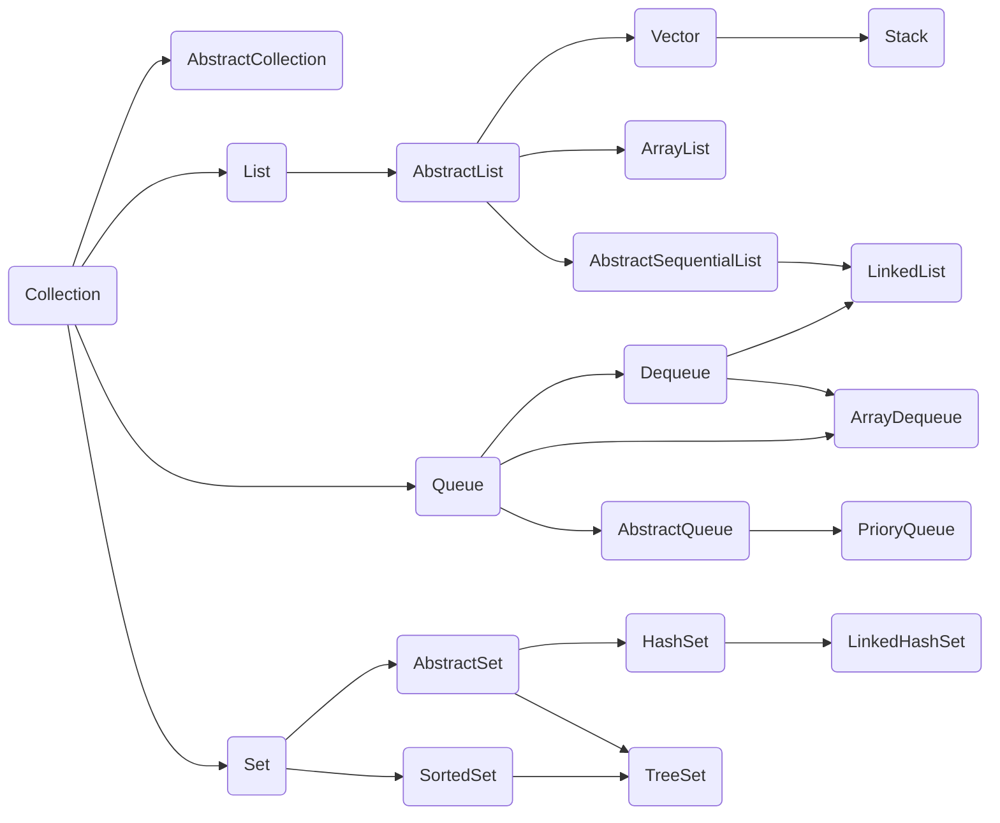
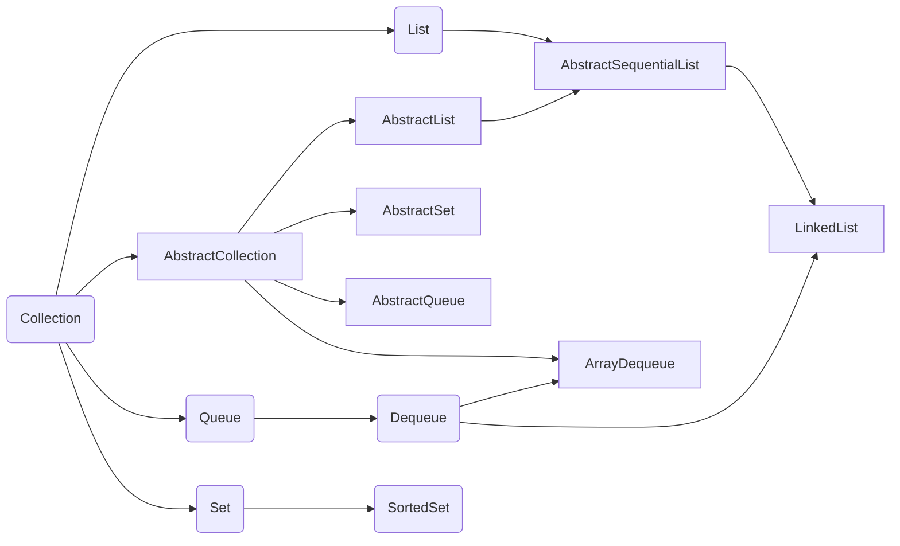
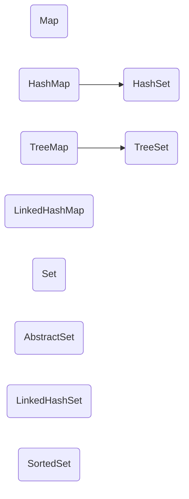

## Java 集合框架

```mermaid
graph LR

C(Collection)
AC(AbstractCollection)

S(Set)
AS(AbstractSet)
TS(TreeSet)
HS(HashSet)
LHS(LinkedHashSet)
SS(SortedSet)

L(List)
ABL(AbstractList)
AL(ArrayList)
ASL(AbstractSequentialList)
LL(LinkedList)
V(Vector)
ST(Stack)

Q(Queue)
AQ(AbstractQueue)
DQ(Dequeue)
PQ(PrioryQueue)
AD(ArrayDequeue)

C-->AC
C-->L
C-->Q
C-->S

L-->ABL
ABL-->V
V-->ST
ABL-->AL
ABL-->ASL
ASL-->LL
DQ-->LL

S-->AS
S-->SS
SS-->TS
AS-->HS
HS-->LHS
AS-->TS

Q-->DQ
Q-->AD
Q-->AQ
DQ-->AD
AQ-->PQ

```

其中抽象类继承关系图

```mermaid
graph LR

C(Collection)
AC[AbstractCollection]

S(Set)
SS(SortedSet)
AS[AbstractSet]

L(List)
ABL[AbstractList]
ASL[AbstractSequentialList]
LL[LinkedList]

Q(Queue)
ABQ[AbstractQueue]
DQ(Dequeue)
AD[ArrayDequeue]


AC-->ABL
AC-->AS
AC-->ABQ
AC-->AD

Q-->DQ
DQ-->AD
DQ-->LL
L-->ASL
ABL-->ASL
ASL-->LL

C-->L
C-->AC
C-->Q
C-->S

S-->SS
```

在具体实现中,TreeSet 内置了 HashSet.HashSet 内部实际就是一个 HashMap.

```mermaid
graph LR

M(Map)
HM(HashMap)
TM(TreeMap)
LHM(LinkedHashMap)


S(Set)
AS(AbstractSet)
TS(TreeSet)
HS(HashSet)
LHS(LinkedHashSet)
SS(SortedSet)

HM-->HS
TM-->TS

```
