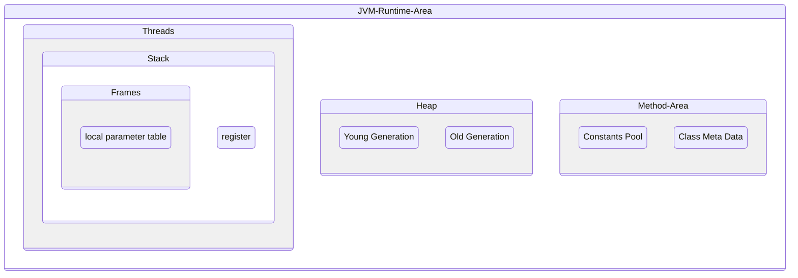

## Java 运行时数据区

### 程序计数器

Program counter register

线程所私有,存放下一个指令所在单元地址.

### 虚拟机栈

- 线程私有
- 每个方法的执行会创建一个栈帧,栈帧中存放局部变量表/操作数栈/动态链接/方法出口等信息.
    - 局部变量表中存放了编译期可知的基本数据类型(boolean/int/float/double/char/byte/long/short),对象引用 reference (不等于对象本身,可能是指向对象起始地址的引用指针,也可能指向一个代表对象的句柄或其他与此对象相关的位置),returnAddress(指向一条字节码指令的地址)

### 本地方法栈

与虚拟机栈类似,区别在于虚拟机栈为 Java 方法服务,而本地方法栈为本地方法服务.

### 堆

Heap

