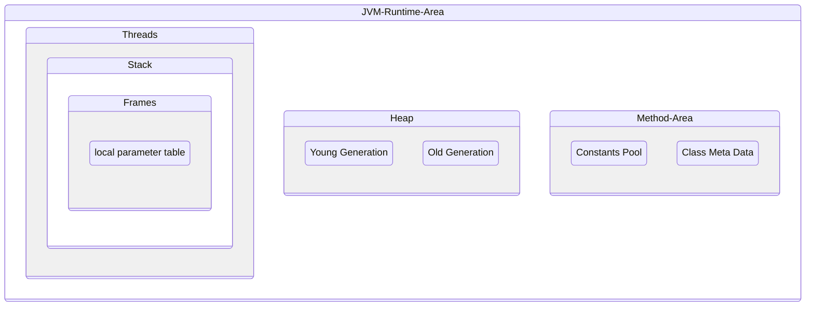

## Structure

```mermaid
stateDiagram-v2
    state JVM-Runtime-Area {
        state Threads {
            state Stack {
                state Frames {
                    p : local parameter table
                }
            }
        }
        state Heap {
            Y : Young Generation
            O : Old Generation
        }

        state Method-Area {
            C : Constants Pool
            C2 : Class Meta Data
        }
    }
```

- MQ 高可用:kafka 直接使用多个 broker 上备份了每个主题的 follower partition
- MQ 如何保证消费幂等性?
    - 业务下游上去处理.比如,在冷库里加唯一约束;查询数据日志是否有被消费;在redis 中添加记录.
- MQ 如何保证可靠性传输?消息不丢失.
    - 
