# 店务流程图-流程图

## DC运营中心-DC出库（B651)
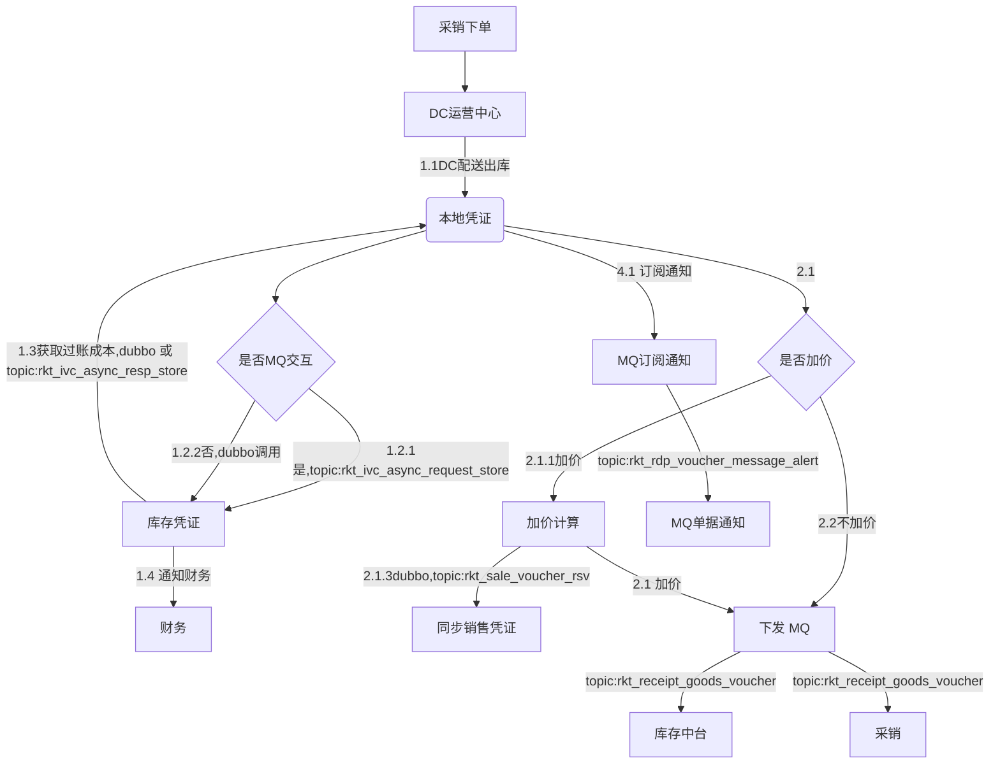
```mermaid
graph TD
opCxPurcher[采销下单]
-->opDC[DC运营中心] -->|1.1DC配送出库|opVoucher(本地凭证)
opVoucher-->condMq{是否MQ交互}
condMq-->|1.2.1是,topic:rkt_ivc_async_request_store|opVoucherStock[库存凭证]
condMq-->|1.2.2否,dubbo调用|opVoucherStock
opVoucherStock-->|1.4 通知财务|opMoney[财务]
opVoucherStock -->|1.3获取过账成本,dubbo 或 topic:rkt_ivc_async_resp_store|opVoucher
opVoucher -->|2.1|condAdd{是否加价}
condAdd -->|2.1.1加价| opAdd[加价计算]
 -->|2.1.3dubbo,topic:rkt_sale_voucher_rsv|opVoucherSale[同步销售凭证]
condAdd -->|2.2不加价| sendMQ[下发 MQ]
opAdd -->|2.1 加价|sendMQ
sendMQ[下发 MQ]-->|topic:rkt_receipt_goods_voucher|opStock[库存中台]
sendMQ[下发 MQ]-->|topic:rkt_receipt_goods_voucher|opCx[采销]
opVoucher -->|4.1 订阅通知|subscribeMQ[MQ订阅通知]
subscribeMQ-->|topic:rkt_rdp_voucher_message_alert|opAlert[MQ单据通知]

```

##DC运营中心-DC出库（B651)-WMS交互
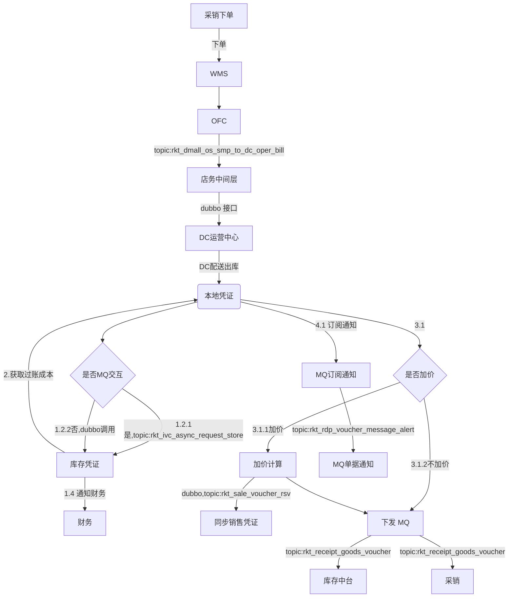
```mermaid
graph TD
opCxPurcher[采销下单] -->|下单|opWms[WMS]
opWms -->opOfc[OFC]
opOfc -->|topic:rkt_dmall_os_smp_to_dc_oper_bill|opMiddle[店务中间层]
 --> |dubbo 接口|opDC[DC运营中心]
opDC -->|DC配送出库|opVoucher(本地凭证)
opVoucher-->condMq{是否MQ交互}
condMq-->|1.2.1是,topic:rkt_ivc_async_request_store|opVoucherStock[库存凭证]
condMq-->|1.2.2否,dubbo调用|opVoucherStock
opVoucherStock-->|1.4 通知财务|opMoney[财务]
opVoucherStock -->|2.获取过账成本|opVoucher
opVoucher -->|3.1|condAdd{是否加价}
condAdd -->|3.1.1加价| opAdd[加价计算] -->|dubbo,topic:rkt_sale_voucher_rsv| opVoucherSale[同步销售凭证]
condAdd -->|3.1.2不加价| sendMQ[下发 MQ]
opAdd -->sendMQ
sendMQ[下发 MQ]-->|topic:rkt_receipt_goods_voucher|opStock[库存中台]
sendMQ[下发 MQ]-->|topic:rkt_receipt_goods_voucher|opCx[采销]
opVoucher -->|4.1 订阅通知|subscribeMQ[MQ订阅通知]
subscribeMQ-->|topic:rkt_rdp_voucher_message_alert|opAlert[MQ单据通知]

```

##关单
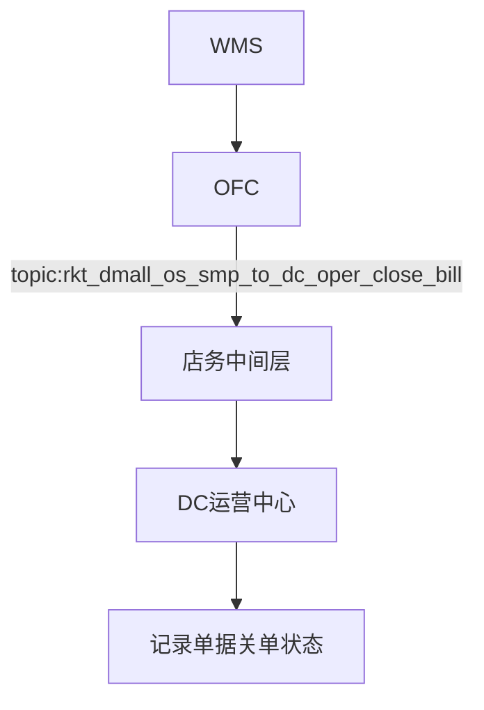
```mermaid
graph TD
opWms[WMS]-->opOfc[OFC]
-->|topic:rkt_dmall_os_smp_to_dc_oper_close_bill|opMiddle[店务中间层] 
--> opDC[DC运营中心]
-->opHandle[记录单据关单状态]
```

##门店运营中心-门店返仓(B662)-WMS 交互

###1-包裹组包
只有物美模式涉及,非物美商家,无包裹信息

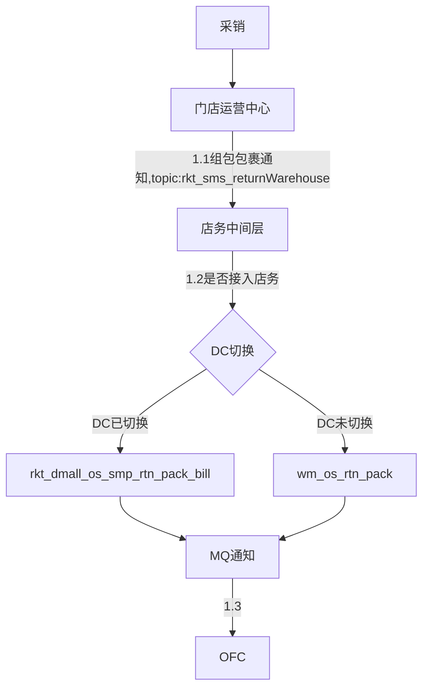
```mermaid
graph TD
opCx[采销]-->opStore[门店运营中心]
-->|1.1组包包裹通知,topic:rkt_sms_returnWarehouse|opMiddle[店务中间层]
-->|1.2是否接入店务|condDC{DC切换}
condDC -->|DC已切换|topic1[rkt_dmall_os_smp_rtn_pack_bill]
condDC -->|DC未切换|topic2[wm_os_rtn_pack]

topic1-->opAlert[MQ通知]
topic2-->opAlert

opAlert-->|1.3 |opOfc[OFC]

```

###2-返仓发货过账

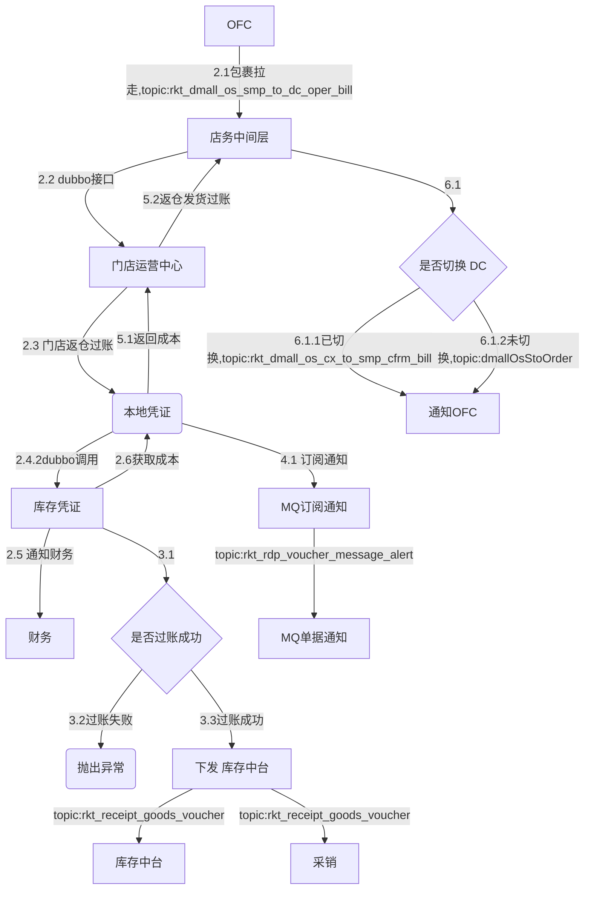
```mermaid
graph TD
opOfc[OFC]
-->|2.1包裹拉走,topic:rkt_dmall_os_smp_to_dc_oper_bill|opMiddle[店务中间层]
-->|2.2 dubbo接口| opStore[门店运营中心]
-->|2.3 门店返仓过账|opVoucher(本地凭证)
opVoucher-->|2.4.2dubbo调用|opVoucherStock[库存凭证]
opVoucherStock-->|2.5 通知财务|opMoney[财务]
opVoucherStock-->|2.6获取成本|opVoucher
opVoucherStock -->|3.1|condSyn{是否过账成功}
condSyn-->|3.2过账失败|e(抛出异常)
condSyn-->|3.3过账成功|sendStockMQ[下发 库存中台]
sendStockMQ-->|topic:rkt_receipt_goods_voucher|opStock[库存中台]
sendStockMQ-->|topic:rkt_receipt_goods_voucher|opCx[采销]
opVoucher -->|4.1 订阅通知|subscribeMQ[MQ订阅通知]
subscribeMQ-->|topic:rkt_rdp_voucher_message_alert|opAlert[MQ单据通知]
opVoucher-->|5.1返回成本|opStore-->|5.2返仓发货过账|opMiddle
-->|6.1|conSyn{是否切换 DC}
conSyn-->|6.1.1已切换,topic:rkt_dmall_os_cx_to_smp_cfrm_bill|opSendOfc[通知OFC]
conSyn-->|6.1.2未切换,topic:dmallOsStoOrder|opSendOfc


```

##盘点

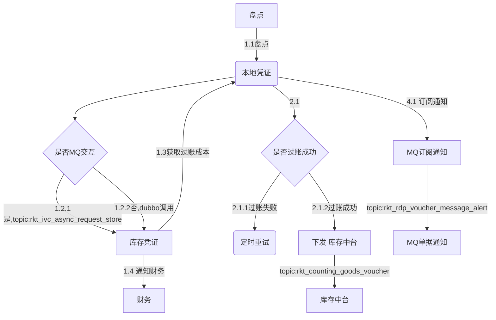
```mermaid
graph TD
opCount[盘点] -->|1.1盘点|opVoucher(本地凭证)
opVoucher-->condMq{是否MQ交互}
condMq-->|1.2.1是,topic:rkt_ivc_async_request_store|opVoucherStock[库存凭证]
condMq-->|1.2.2否,dubbo调用|opVoucherStock
opVoucherStock -->|1.3获取过账成本|opVoucher
opVoucherStock-->|1.4 通知财务|opMoney[财务]
opVoucher -->|2.1|condAdd{是否过账成功}
condAdd -->|2.1.1过账失败|e(定时重试)
condAdd -->|2.1.2过账成功| sendStockMQ[下发 库存中台]-->|topic:rkt_counting_goods_voucher|opStock[库存中台]
opVoucher -->|4.1 订阅通知|subscribeMQ[MQ订阅通知]
subscribeMQ-->|topic:rkt_rdp_voucher_message_alert|opAlert[MQ单据通知]

```

##携出归还
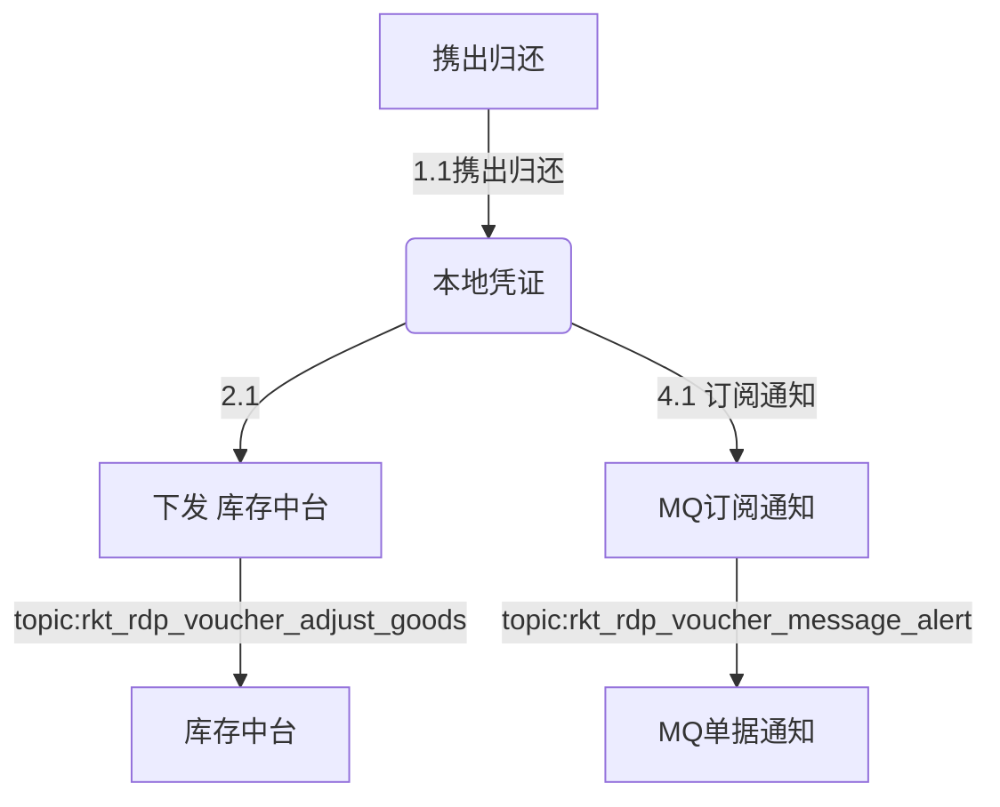
```mermaid
graph TD
opCount[携出归还] -->|1.1携出归还|opVoucher(本地凭证)
opVoucher -->|2.1| sendStockMQ[下发 库存中台]-->|topic:rkt_rdp_voucher_adjust_goods|opStock[库存中台]
opVoucher -->|4.1 订阅通知|subscribeMQ[MQ订阅通知]
subscribeMQ-->|topic:rkt_rdp_voucher_message_alert|opAlert[MQ单据通知]
```

##移库

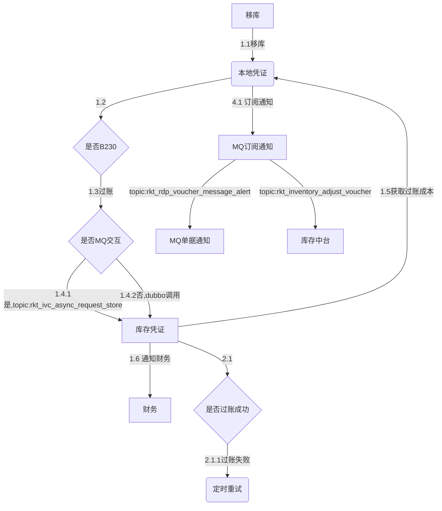
```mermaid
graph TD
opCount[移库] -->|1.1移库|opVoucher(本地凭证)
opVoucher-->|1.2|condB230{是否B230}
condB230-->|1.3过账|condMq{是否MQ交互}
condMq-->|1.4.1是,topic:rkt_ivc_async_request_store|opVoucherStock[库存凭证]
condMq-->|1.4.2否,dubbo调用|opVoucherStock
opVoucherStock -->|1.5获取过账成本|opVoucher
opVoucherStock-->|1.6 通知财务|opMoney[财务]
opVoucherStock -->|2.1|condSyn{是否过账成功}
condSyn -->|2.1.1过账失败|e(定时重试)
opVoucher -->|4.1 订阅通知|subscribeMQ[MQ订阅通知]
subscribeMQ-->|topic:rkt_rdp_voucher_message_alert|opAlert[MQ单据通知]
subscribeMQ-->|topic:rkt_inventory_adjust_voucher|opStock[库存中台]

```

##库调
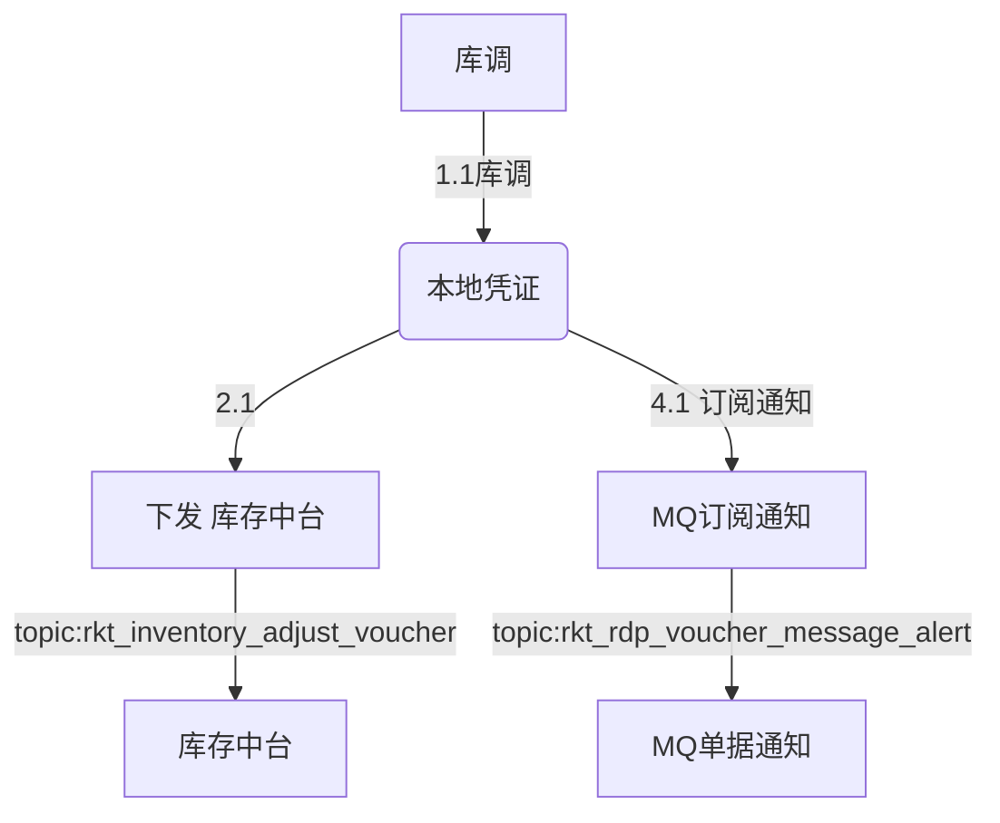
```mermaid
graph TD
opCount[库调] -->|1.1库调|opVoucher(本地凭证)
opVoucher -->|2.1| sendStockMQ[下发 库存中台]-->|topic:rkt_inventory_adjust_voucher|opStock[库存中台]
opVoucher -->|4.1 订阅通知|subscribeMQ[MQ订阅通知]
subscribeMQ-->|topic:rkt_rdp_voucher_message_alert|opAlert[MQ单据通知]
```

##门店收货

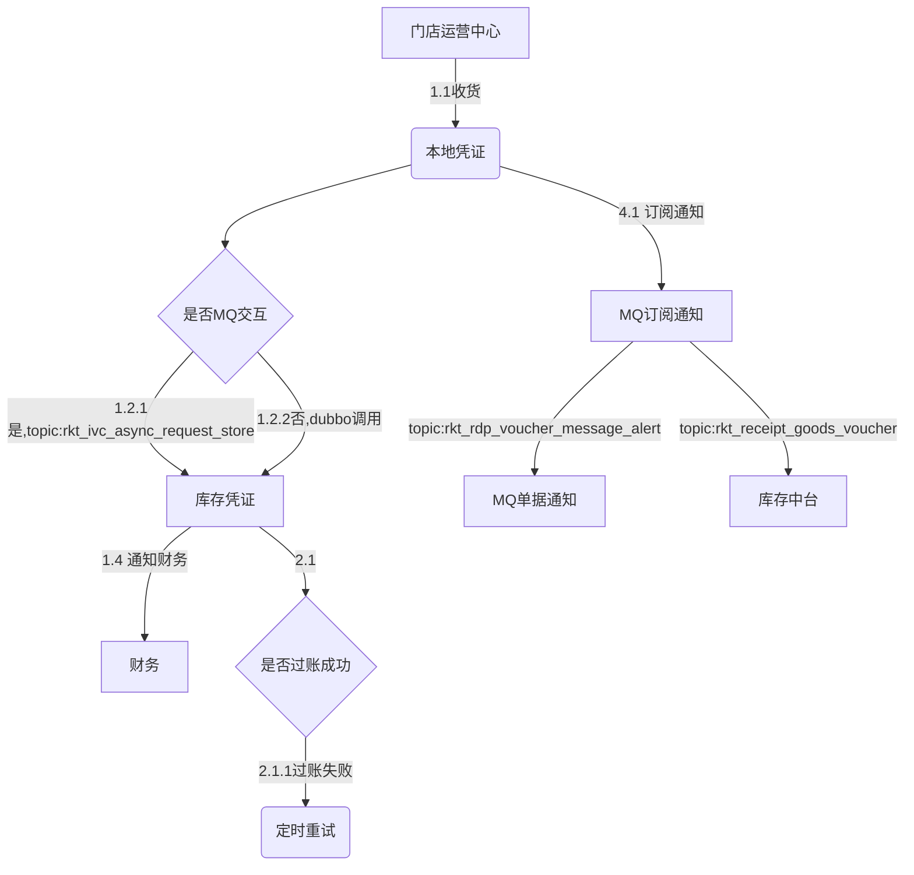
```mermaid
graph TD
opCount[门店运营中心] -->|1.1收货|opVoucher(本地凭证)
opVoucher-->condMq{是否MQ交互}
condMq-->|1.2.1是,topic:rkt_ivc_async_request_store|opVoucherStock[库存凭证]
condMq-->|1.2.2否,dubbo调用|opVoucherStock
opVoucherStock-->|1.4 通知财务|opMoney[财务]
opVoucherStock -->|2.1|condAdd{是否过账成功}
condAdd -->|2.1.1过账失败|e(定时重试)
opVoucher -->|4.1 订阅通知|subscribeMQ[MQ订阅通知]
subscribeMQ-->|topic:rkt_rdp_voucher_message_alert|opAlert[MQ单据通知]
subscribeMQ-->|topic:rkt_receipt_goods_voucher|opStock[库存中台]
```
##加工(B323)

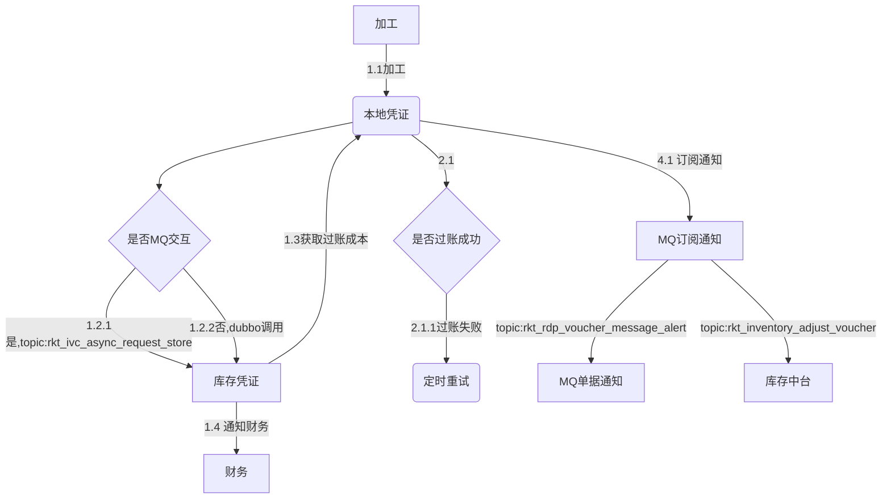
```mermaid
graph TD
opCount[加工] -->|1.1加工|opVoucher(本地凭证)
opVoucher-->condMq{是否MQ交互}
condMq-->|1.2.1是,topic:rkt_ivc_async_request_store|opVoucherStock[库存凭证]
condMq-->|1.2.2否,dubbo调用|opVoucherStock
opVoucherStock -->|1.3获取过账成本|opVoucher
opVoucherStock-->|1.4 通知财务|opMoney[财务]
opVoucher -->|2.1|condAdd{是否过账成功}
condAdd -->|2.1.1过账失败|e(定时重试)
opVoucher -->|4.1 订阅通知|subscribeMQ[MQ订阅通知]
subscribeMQ-->|topic:rkt_rdp_voucher_message_alert|opAlert[MQ单据通知]
subscribeMQ-->|topic:rkt_inventory_adjust_voucher|opStock[库存中台]

```

##分割(B325)

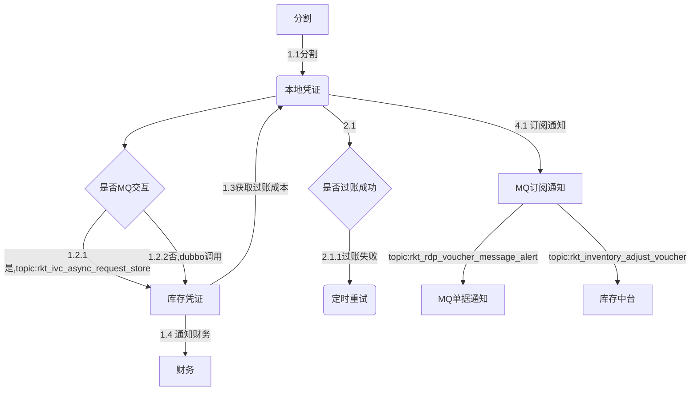
```mermaid
graph TD
opCount[分割] -->|1.1分割|opVoucher(本地凭证)
opVoucher-->condMq{是否MQ交互}
condMq-->|1.2.1是,topic:rkt_ivc_async_request_store|opVoucherStock[库存凭证]
condMq-->|1.2.2否,dubbo调用|opVoucherStock
opVoucherStock -->|1.3获取过账成本|opVoucher
opVoucherStock-->|1.4 通知财务|opMoney[财务]
opVoucher -->|2.1|condAdd{是否过账成功}
condAdd -->|2.1.1过账失败|e(定时重试)
opVoucher -->|4.1 订阅通知|subscribeMQ[MQ订阅通知]
subscribeMQ-->|topic:rkt_rdp_voucher_message_alert|opAlert[MQ单据通知]
subscribeMQ-->|topic:rkt_inventory_adjust_voucher|opStock[库存中台]

```

##AB码转换(B581)

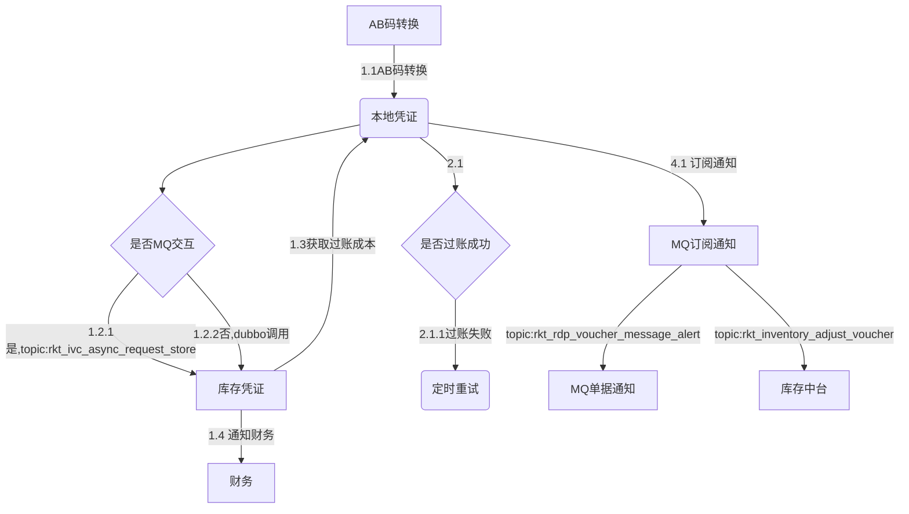
```mermaid
graph TD
opCount[AB码转换] -->|1.1AB码转换|opVoucher(本地凭证)
opVoucher-->condMq{是否MQ交互}
condMq-->|1.2.1是,topic:rkt_ivc_async_request_store|opVoucherStock[库存凭证]
condMq-->|1.2.2否,dubbo调用|opVoucherStock
opVoucherStock -->|1.3获取过账成本|opVoucher
opVoucherStock-->|1.4 通知财务|opMoney[财务]
opVoucher -->|2.1|condAdd{是否过账成功}
condAdd -->|2.1.1过账失败|e(定时重试)
opVoucher -->|4.1 订阅通知|subscribeMQ[MQ订阅通知]
subscribeMQ-->|topic:rkt_rdp_voucher_message_alert|opAlert[MQ单据通知]
subscribeMQ-->|topic:rkt_inventory_adjust_voucher|opStock[库存中台]

```

##领用(B401)

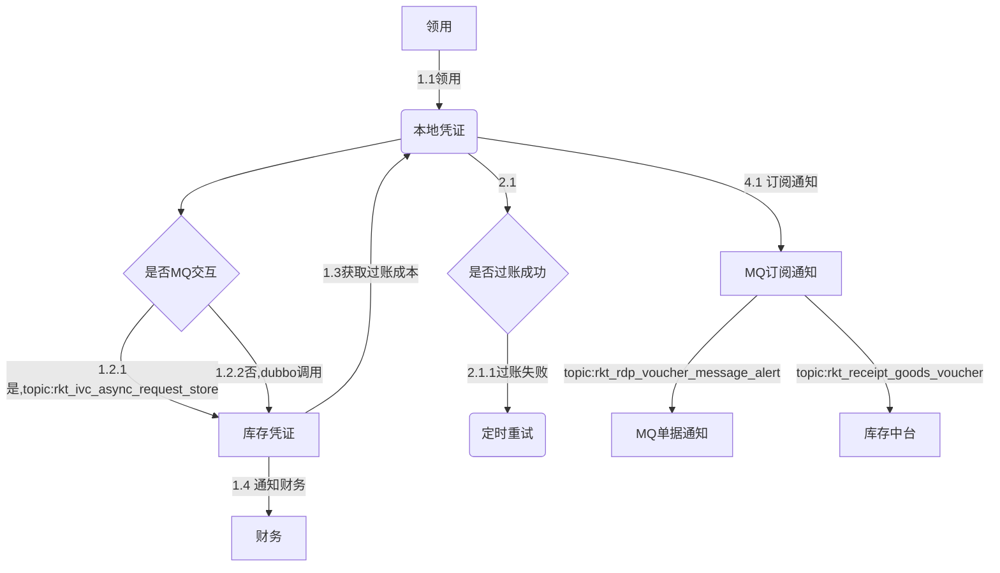
```mermaid
graph TD
opCount[领用] -->|1.1领用|opVoucher(本地凭证)
opVoucher-->condMq{是否MQ交互}
condMq-->|1.2.1是,topic:rkt_ivc_async_request_store|opVoucherStock[库存凭证]
condMq-->|1.2.2否,dubbo调用|opVoucherStock
opVoucherStock -->|1.3获取过账成本|opVoucher
opVoucherStock-->|1.4 通知财务|opMoney[财务]
opVoucher -->|2.1|condAdd{是否过账成功}
condAdd -->|2.1.1过账失败|e(定时重试)
opVoucher -->|4.1 订阅通知|subscribeMQ[MQ订阅通知]
subscribeMQ-->|topic:rkt_rdp_voucher_message_alert|opAlert[MQ单据通知]
subscribeMQ-->|topic:rkt_receipt_goods_voucher|opStock[库存中台]

```

## 店间调拨发货（B801)
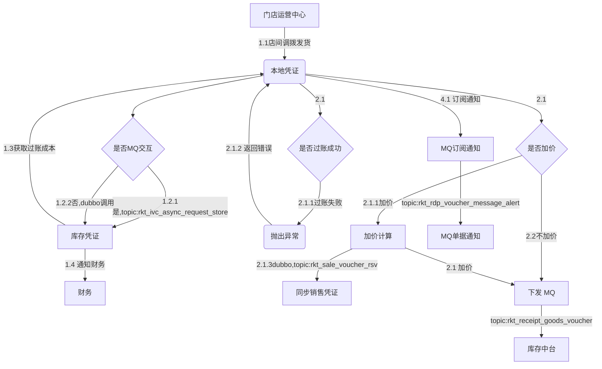
```mermaid
graph TD
opDC[门店运营中心] -->|1.1店间调拨发货|opVoucher(本地凭证)
opVoucher-->condMq{是否MQ交互}
condMq-->|1.2.1是,topic:rkt_ivc_async_request_store|opVoucherStock[库存凭证]
condMq-->|1.2.2否,dubbo调用|opVoucherStock
opVoucherStock-->|1.4 通知财务|opMoney[财务]
opVoucherStock -->|1.3获取过账成本|opVoucher
opVoucher -->|2.1|condSyn{是否过账成功}
condSyn -->|2.1.1过账失败|e(抛出异常)
e-->|2.1.2 返回错误|opVoucher
opVoucher -->|2.1|condAdd{是否加价}
condAdd -->|2.1.1加价| opAdd[加价计算]
 -->|2.1.3dubbo,topic:rkt_sale_voucher_rsv|opVoucherSale[同步销售凭证]
condAdd -->|2.2不加价| sendMQ[下发 MQ]
opAdd -->|2.1 加价|sendMQ
sendMQ[下发 MQ]-->|topic:rkt_receipt_goods_voucher|opStock[库存中台]
opVoucher -->|4.1 订阅通知|subscribeMQ[MQ订阅通知]
subscribeMQ-->|topic:rkt_rdp_voucher_message_alert|opAlert[MQ单据通知]


```
##店间调拨收货（B802)

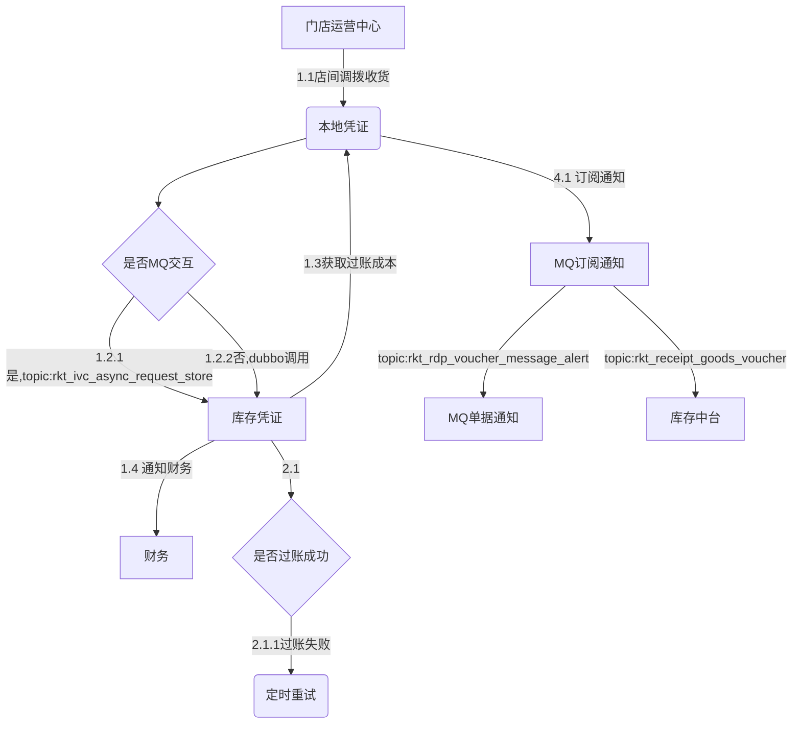
```mermaid
graph TD
opCount[门店运营中心] -->|1.1店间调拨收货|opVoucher(本地凭证)
opVoucher-->condMq{是否MQ交互}
condMq-->|1.2.1是,topic:rkt_ivc_async_request_store|opVoucherStock[库存凭证]
condMq-->|1.2.2否,dubbo调用|opVoucherStock
opVoucherStock -->|1.3获取过账成本|opVoucher
opVoucherStock-->|1.4 通知财务|opMoney[财务]
opVoucherStock -->|2.1|condAdd{是否过账成功}
condAdd -->|2.1.1过账失败|e(定时重试)
opVoucher -->|4.1 订阅通知|subscribeMQ[MQ订阅通知]
subscribeMQ-->|topic:rkt_rdp_voucher_message_alert|opAlert[MQ单据通知]
subscribeMQ-->|topic:rkt_receipt_goods_voucher|opStock[库存中台]

```
